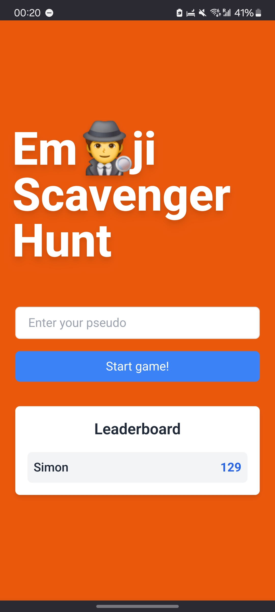
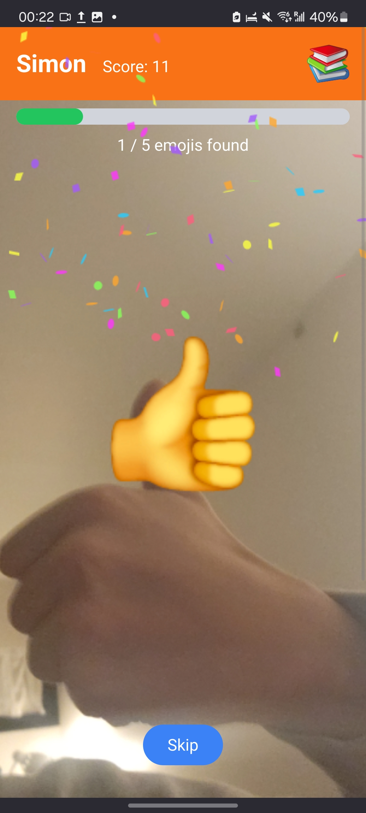

# 🎉 Emoji Scavenger Hunt

A fun and interactive emoji scavenger hunt game inspired by **Google's Emoji Scavenger Hunt**. This version uses the **PixTral model** from Mistral AI for real-time image recognition. Find the emoji displayed on the screen using real-world objects and earn points based on how quickly you find it. Finish the game and see your score updated on the leaderboard!

Using a multimodal LLM like PixTral for image recognition is a powerful but somewhat "brute-force" approach. It requires a backend capable of handling significant computational resources. In contrast, Google's original Emoji Scavenger Hunt used a simpler TensorFlow model that performed image recognition locally in the browser. While PixTral offers flexibility and accuracy, this trade-off highlights the difference in resource requirements for different solutions.

## 📸 Screenshots

<div style="display: flex; justify-content: space-between;">
  
  
</div>

## 🚀 How to Play

1. **Enter your name** and press the "Start game" button

2. **Find the emoji** displayed on the screen using real-world objects around you.

3. **Earn points** based on how quickly you find the emoji.

4. **Finish the game** and see your score updated on the leaderboard.

5. **Pass the device to a friend** and see if they can beat your score!

## 🛠️ Technologies

- **Next.js**
- **React**
- **PixTral** for image recognition
- **Confetti.js** for celebrations

## 📦 Installation

1. Clone the repository:

```bash
git clone https://github.com/SimonLeclere/EmojiScavengerHunt.git
cd emoji-scavenger-hunt
```

2. Install dependencies:

```bash
npm install
```

3. Rename the `.env.example` file in the root directory and add the following environment variables:

```bash
MISTRAL_API_KEY=YOUR_MIXTRAL_API_KEY
```

4. Start the development server:

```bash
npm run dev
```

Open <http://localhost:3000> and start hunting! 🕵️‍♂️
